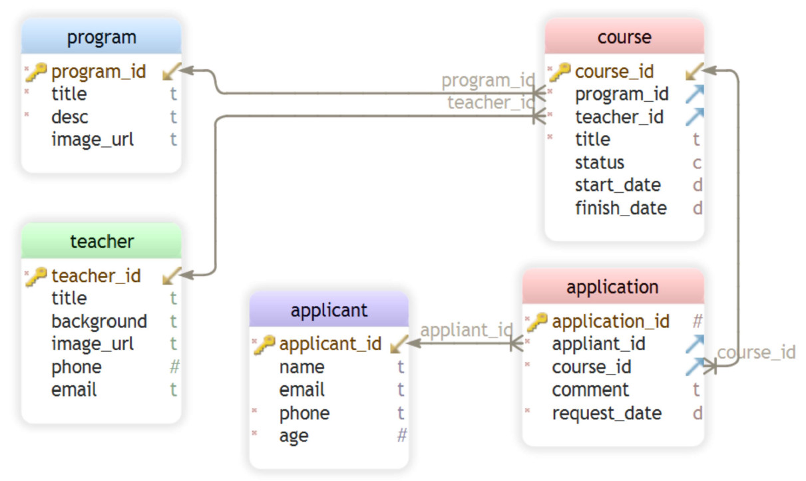

# ComIT-NodeJS Project
Sample responsive website as the final project for the ComIT-Nodejs course assisted by TIES
## Website address
https://barsam.herokuapp.com/
## Features
* The project is a sample website suitable for a tutoring organization.
* The focus is on Nodejs, MongoDB and, using a structured relational database approach. 
* It comes with 5 HTML pages including Home (landing page), Programs, Teachers. Courses, and Contact, as well as a secured page for the admin to work on transactions within the app.
## Platform
### Frontend
* HTML: Structure is based on html and html templates
* Bootstrap: for styling the html I used bootstrap and 
* CSS: a little bit CSS wherever bootstrap does not have desired facilities 
### DB model
* MongoDB: used for db model and design of data
* Mongoose:  The data are modeled based on normalised db model, i.e. dividing the data into multiple collections with references between those collections and using populate methods and queries accordingly
#### Collections
* Programs: main category of the tutoring service, e.g "Applied Science"
* Courses: are defined under each program; e.g. "Physics 20" or "Physics 30" under "Applied Science" program
* Teachers: are defined separately and then, can be allocated to 0 to many courses (not functional in this version yet)
* Applicants: are users that can apply for one or more courses 
* Applications: a transaction in which an applicant (user) can apply for a specific course 

### Backend
* Nodejs: used as server-side platform
* Express: used to provide web application server and implement methods, call HTTP verb ( GET , POST , SET , etc.) and URL pattern ("Route")
* ejs: for rendering htmls
* body-parser: a middleware for parsing the incoming request bodies, such as the JSON data submitted using HTTP POST request.
## Future Expansion
* Add more CRUD freatures (currently the app can only add new programs, courses, applicants and applications, the rest should be implemented directly through MongoDB compass)
* Add various reports using Mongoos's aggregate and populate methods and features 

